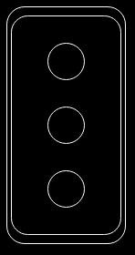
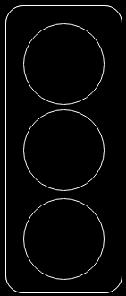
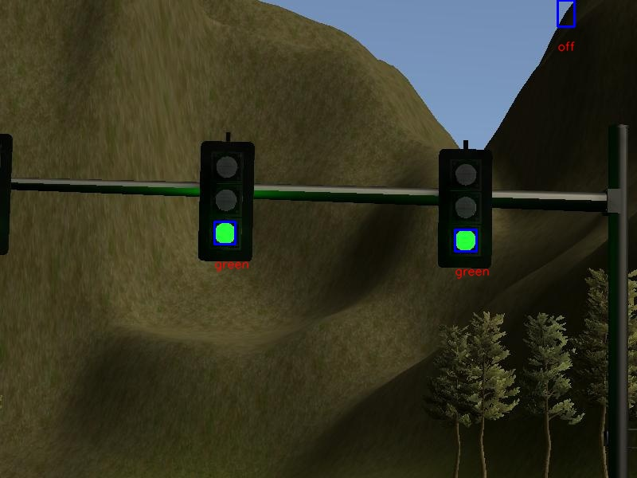
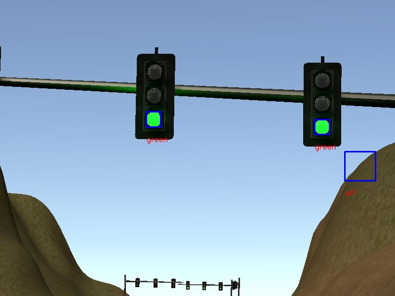

### About

This is a codebase for recognizing traffic light color present in the given image. \
Approach followed in this codebase is strictly heuristic due to lack of data to perform any learning based approach.

### Approach

1. `RGB` image is converted to `LUV` color space. This was done to separate out the intensity profile from the \
brightness profile of the image.
2. `Top-hat` morphological operator is used for highlighting traffic light area
   1. `L` channel of the LUV image is used for this purpose
   2. `get_top_hat()` function in the codebase is responsible for the above operation
3. Connected Component Analysis (Blob extractions)
   1. `top_hat` image obtained from above step is thresholded using `OTSU` method
   2. `L2` distance based, distance transform is then computed over the thresholded image
   3. `8-Connected` components are then fetched out from the distance transform image
4. Blob filtering
   1. Geometric features are used for filtering out the blob proposals
      1. If `max(h, w) > 2 * min(h, w)`, where `h & w` are the width and height of the bbox for a blob
      2. Circularity defined as `perimeter / (2 * sqrt(pi * area))` has been used a measure to filter out non circular blobs
      3. Details for the above steps can be found in the function `filter_blobs()`
   2. Template Matching
      1. Custom templates have been used to further identify regions of interest. Some examples of the templates are given below.
      2. Since Template Matching is time-consuming process on entire image, crops have been extracted out from the \
      complete image using filtered blob centers
      3. Feature matching is then just restricted to the crop area allowing efficient implementation of Template Matching.
5. Traffic Light Classification
   1. Since no learning based approach is being used in this codebase, simple statistical approach on the `RGB` content 
   has been used to classify a blob into `red`, `green`, `yellow` and `off` category
6. Visualization
   1. Bbox has been drawn on the image around the identified blobs and traffic label identified is written below it.

**Custom templates used in this project:**

       
   
   

### Sample Output

### Dependencies
- `opencv-contrib-python==3.4.2.16`
- `numpy==1.16.4`
- `imutils==0.5.2`

### Future Work
- Exploring Learning Based approaches
  - Use `HOG` type features to train a classifier to identify a region of interest
  - Train classifier for identifying the state of the traffic light
  - Use Large Scale data for creating templates for template matching based approach
  - Use CNN based architectures like SSD, FRCNN etc. for traffic light detection part
    - Given we can't have too many pooling layers due to the small size of the objects of interest
    - Hence, it will be an interplay between accuracy and number of parameters